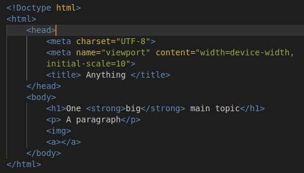

First Project: Recipes 

Expect to apply the basic structure of HTML5
for the design of a web page. Basic structure
is related to, but not limited to the following:

<!DOCTYPE hmtl>
<html lang="en">
<head>
<meta charset="UTF-8">
</head>
<body>

</body>
</html>
